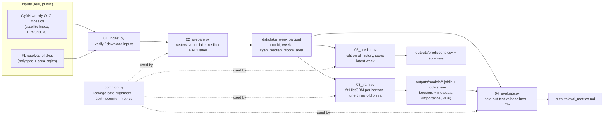
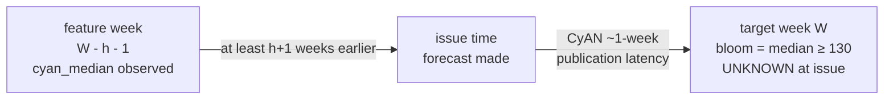

# Code Map — the operational lean model (`ex-operational-poc/`)

> A **simple, self-contained** map of the one workflow that delivers the operational
> forecaster: the **lean 2-feature model** (`cyan_median` + `area_sqkm`) that predicts WHO
> Alert-Level-1 cyanobacteria blooms for Florida lakes, 0–4 weeks ahead. It lives in
> [`ex-operational-poc/`](ex-operational-poc/) and depends on nothing else in the repo at
> runtime except the cached CyAN rasters and the Florida lakes layer.
>
> This is the deliberately-minimal counterpart to the full [`CODE-MAP.md`](CODE-MAP.md): the
> broader study already showed this 2-feature model is the right operational choice, so here
> we build *only* it, and *only* the data it needs. The section that matters most is
> [§4 — avoiding autoregressive leakage](#4-avoiding-autoregressive-leakage-the-essential-part).

---

## 1. The workflow at a glance

Five numbered scripts, run in order. Each does one thing and hands a file to the next.



Everything routes through **`common.py`**, the small tested core, so the one piece of
logic that must be correct (the leakage-safe alignment) exists in exactly one place.

---

## 2. The five steps

| Step | Script | Reads | Writes | What it does |
|------|--------|-------|--------|--------------|
| 1 · ingest | `01_ingest.py` | CyAN cache, FL lakes | — | Verify both inputs are present and the weekly series is complete (flag any gaps); if the cache is empty, direct you to the repo's cited CyAN pull (`data-sources/cyan`). |
| 2 · prepare | `02_prepare.py` | CyAN rasters, FL lakes | `data/lake_week.parquet` | Rasterize the 133 lakes once over a FL window; per week, take each lake's **median DN** over valid pixels; label **bloom = median ≥ 130**. |
| 3 · train | `03_train.py` | `lake_week.parquet` | `outputs/models/*.joblib` + `models.json` | Per horizon: leakage-safe align → temporal split → fit **HistGBM** on **train**, tune threshold on **val**, refit on **train+val**; persist booster + readable metadata. |
| 4 · evaluate | `04_evaluate.py` | panel + `models.json` | `outputs/eval_metrics.md` | Score the held-out **test** period vs persistence + climatology, with block-bootstrap CIs. |
| 5 · predict | `05_predict.py` | panel + `models.json` | `outputs/predictions.csv` (+ summary) | Refit each horizon on **all** labelled history; score each lake's freshest CyAN → AL1 risk for target week = latest CyAN week + (h+1). |

`config.py` holds every path, threshold (`AL1_THRESHOLD = 130`), split boundary
(`TRAIN_END`, `VAL_END`), and the feature list — one place to change anything.

---

## 3. The model

- **Features (2, that's all):** `cyan_median` (the lake's antecedent median CyAN index) and
  `area_sqkm` (static lake area).
- **Target:** `bloom` = per-lake weekly median CyAN DN ≥ 130 = WHO Alert Level 1 (~12 µg/L
  chlorophyll-a; the EPA/Schaeffer operationalization).
- **Architecture:** a **HistGradientBoostingClassifier** (gradient-boosted trees), one model
  per horizon `h ∈ {0..4}`. This is the study-selected architecture for the lean set: on the
  identical two features the trees beat a logistic GLM on the decision metric (h=1 onset-AUC
  0.916 vs 0.823, onset-MCC 0.314 vs 0.158; `../models/outputs/exp_feature_ablation.md`),
  capturing the non-linear `cyan_median × area` interaction a linear logit cannot. Hyperparameters
  are copied verbatim from the study harness (`config.HGB_PARAMS` ← `models/model/experiment_lib.py::_hgb`).
  The booster is persisted with **joblib** (`outputs/models/hgb_h{h}.joblib`). Trees are not
  human-readable coefficients, so transparency comes instead from a **permutation-importance**
  breakdown and a **CyAN partial-dependence** curve written to `models.json`.
- **Protocol:** fit on **train**, tune the alert threshold on **val**, then **refit on train+val**
  (the deployed-for-test model), predict test — matching `../models`.
- **Split:** purely temporal — train `< 2022-07`, val `[2022-07, 2024-07)`, test `≥ 2024-07`.
  Never random (lake-weeks are autocorrelated).

---

## 4. Avoiding autoregressive leakage (the essential part)

This model is **autoregressive**: it predicts a threshold on the CyAN median using the CyAN
median from an earlier week. That is legitimate *only* if the feature can never peek at (or
past) the week being forecast. Two rules enforce it.

**The timeline for a horizon-`h` forecast of week `W`:**



1. **Antecedent-only + latency.** The feature is taken from week **`W − (h+1)`**, never `W`.
   The `+1` is CyAN's ~1-week publication latency: the freshest composite actually *available*
   when the forecast is issued is one week behind the nominal lead. Using week `W`'s CyAN would
   be circular — "predicting" a threshold on a number from that same number.
2. **Freshest-available, gap-safe.** If week `W − (h+1)` is missing (cloud), we fall back to the
   most recent composite *at or before* that cutoff — the honest "what you'd really have on the
   day" — via a **backward as-of join**. We never reach forward.

**Where it lives (one function):** `common.build_horizon_frame(panel, h)` computes
`cutoff = target_date − (h+1) weeks`, does a `merge_asof(direction="backward")` per lake, and
then **hard-asserts** that every matched feature week is `≤ target − (h+1) weeks`. A leak is a
crash, not a silent bug. The `persistence` baseline is the label carried from that same feature
week, so it is latency-aware by construction.

**Other leakage guards in the same spirit:**

| Guard | Where |
|-------|-------|
| No random shuffling of autocorrelated weeks | `common.temporal_split` (split by date only) |
| Threshold tuned on **validation**, never test | `03_train.py` → `common.best_f1_threshold` |
| Climatology baseline fit on **train+val only** | `04_evaluate.py` → `common.climatology_lookup` |
| CIs bootstrap **whole lakes**, not rows | `common.block_bootstrap_auc_ci` |
| Single sensor (OLCI), so no cross-sensor jump | `01/02` filter to the `L` prefix |

**Tested:** `tests/test_common.py` asserts the feature week is exactly `(h+1)` weeks back on a
clean panel, is never within `(h+1)` weeks of the target, falls back to an *older* week across a
gap (never a newer one), and that persistence equals the feature-week label — plus the model core
(HistGBM fit/score, joblib round-trip, permutation importance leaning on `cyan_median`) and the
metrics (AUC, onset-AUC, MCC, onset-MCC). All green.

---

## 5. Results (held-out test)

Full breakdown (all-sample AUC, onset-AUC, all-sample MCC, and onset-MCC — each with its
baselines) is in `outputs/eval_metrics.md`, regenerated by `04_evaluate.py`. Base rate ≈ **0.267
on the test window** (0.233 over the full panel — the target rate drifts up over the record).

The **decision-relevant metric is onset-AUC** (early warning on currently-clear lakes). The
study's held-out numbers for this exact model — the `greedy_lean · histgbm` row of
[`models/outputs/exp_feature_ablation.md`](models/outputs/exp_feature_ablation.md), the same
figures the deck ships (`presentation/story.html`) — are, at the primary horizon **h=1**:

| model (h=1, 2-yr held-out test) | all-sample AUC | onset-AUC | onset-MCC |
|--|--:|--:|--:|
| **lean HistGBM (this pipeline)** | **0.982** | **0.916** | **0.314** |
| lean logistic GLM (what we *used* to ship) | 0.970 | 0.823 | 0.158 |
| climatology (baseline) | 0.936 | 0.851 | 0.323 |
| persistence (baseline) | 0.926 | 0.500 | 0.000 |

> **These are the study's numbers on the study's feature table.** This standalone pipeline rebuilds
> `cyan_median` independently from the raw rasters, so its regenerated `eval_metrics.md` lands very
> close but not bit-identical — run `03→04` against the CyAN cache to produce this pipeline's own
> figures. (The committed `outputs/` currently still hold the previous *logistic* run and **must be
> regenerated** — see the banner in `outputs/eval_metrics.md`.)

**Reading it honestly.** All-sample AUC (~0.98) is high but **autocorrelation-dominated** —
persistence scores nearly as well, so it is not the result. On the decision-relevant **onset-AUC**,
the gradient-boosted trees give the lean model genuine early-warning skill and a clear lift over the
logistic fit (0.916 vs 0.823) — the study's reason for selecting this architecture. A per-lake
seasonal **climatology — itself only a baseline — stays competitive**, especially at longer lead:
climatology depends only on the target week's calendar position, so it is horizon-invariant and pays
no lead-time penalty, while the lean model's real-time feature goes stale. So the lean model's value
is **a cheap, deployable early-warning forecaster that extends EPA's 1-week nowcast to 0–4 weeks**
while staying competitive — not beating every baseline; the richer real-time-CyAN + fusion ladder in
[`models/`](models/RESULTS-SUMMARY.md) is the unproven avenue for pushing onset skill higher. The
label is a satellite realization, not toxin. Correlation, not causation.

---

## 6. Run it

```bash
cd ex-operational-poc
pip install -r requirements.txt
python 01_ingest.py && python 02_prepare.py && python 03_train.py \
  && python 04_evaluate.py && python 05_predict.py
python -m pytest tests/
```

Deterministic on a fixed environment (seed 42, which also fixes HistGBM's internal early-stopping
holdout); runs against the CyAN rasters already cached in the repo. The reported metrics (3 decimals)
are stable across platforms; the serialized boosters are sklearn-version-sensitive, so regenerate
`outputs/models/*.joblib` after a scikit-learn upgrade rather than trusting an old pickle. See
[`ex-operational-poc/README.md`](ex-operational-poc/README.md) for the file-by-file rundown.

---

*Companion maps: [`ARCHITECTURE.md`](ARCHITECTURE.md) (repo structure) ·
[`CODE-MAP.md`](CODE-MAP.md) (the full codebase) · [`README.md`](README.md) (product overview).*
