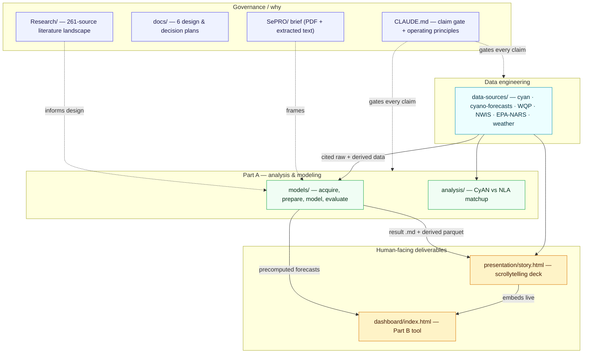
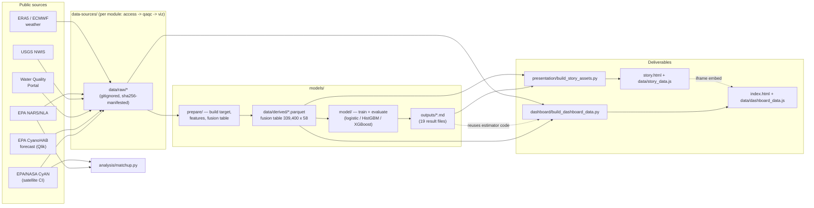
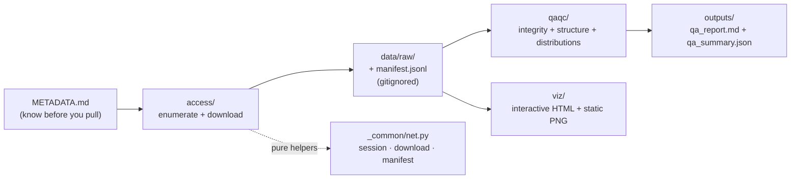
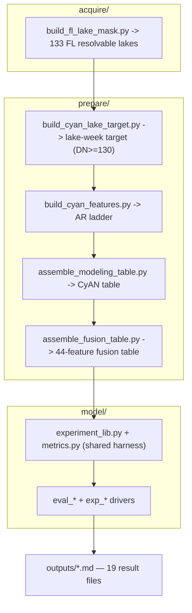
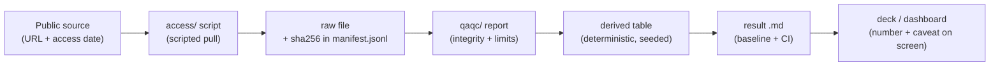
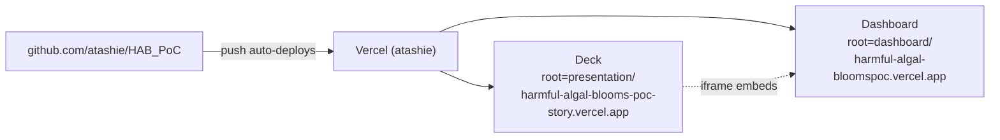

# Repository Architecture — SePRO HAB PoC

> A map of **what is in this repository and how it fits together**: every folder, every
> document, and where the code lives. For a function-level tour of the code itself, see the
> companion document [`CODE-MAP.md`](CODE-MAP.md).
>
> Generated 2026-07-10 from a full read of the repo. Everything here traces to checked-in files;
> where a number is stated it was counted from `git ls-files` or read from a source doc.

---

## 1. What this repository is

A proof-of-concept **Harmful Algal Bloom (HAB) diagnostic & treatment-recommendation tool**, built
for the SePRO Lead Data Scientist finalist case study. The deliverable has three parts:

- **Part A — Analysis.** Fuse a satellite signal (EPA/NASA **CyAN**) with in-situ + weather data to
  forecast **WHO Alert-Level-1 cyanobacteria blooms** in Florida lakes, benchmarked head-to-head
  against the EPA CyanoHAB forecast — explainable and defensible enough to stand behind a claim.
- **Part B — Tool.** A small interactive dashboard for a non-technical user (`dashboard/`).
- **Part C — Prototype → platform.** A data-architecture / production / roadmap sketch (carried in
  the deck's Part 3).

The whole repo is organized around one non-negotiable spine: the **claim gate** — every number
traces to a cited real source **and** the exact code that produced it, regenerates from checked-in
code, carries a baseline + an uncertainty, and is stated with its limits. That principle is what the
folder structure is built to serve.

---

## 2. The repository at a glance

| Layer | Folder | Role | Code | Tracked docs |
|-------|--------|------|------|--------------|
| **Literature base** | `Research/` | 261-source science landscape (the *why*) | 8 Python + 17 generated JS | 261 dossiers + 5 category syntheses + registries |
| **Data engineering** | `data-sources/` | Scripted, cited acquisition + QA of every public source | ~70 Python files, 9.6k LOC | per-dataset README + METADATA + QA reports |
| **Modeling (Part A)** | `models/` | Acquire → prepare → model → evaluate the FL bloom forecaster | 25 Python files, 3.7k LOC | DESIGN, RESULTS-SUMMARY, decisions, 4 phase docs, 19 result files |
| **Standalone analysis** | `analysis/` | CyAN ↔ EPA-lab (NLA) validation matchup | 1 Python file, 361 LOC | README + report |
| **Presentation** | `presentation/` | Self-contained HTML scrolling-story deck | 3 Python builders + `story.html` | README + 6 design plans (in `docs/`) |
| **Tool (Part B)** | `dashboard/` | Deployed static risk dashboard | 1 Python builder + `index.html` | README + notes + 2 Codex reviews |
| **Brief & plans** | `SePRO/`, `docs/` | Source-of-truth brief + design/decision plans | — | brief PDF + text, 6 plan docs |

**Totals:** 599 git-tracked files · ~17k LOC of first-party Python · ~2.7k LOC of app HTML/JS
(excluding vendored Leaflet/Plotly) · **two deployed static sites** on Vercel.

**Corpus of literature:** 261 sources — ACAD 148 (peer-reviewed), FED 78 (EPA/USGS/NOAA/NASA/CDC),
SLG 13 (state/local), NGO 13 (incl. WHO), PVT 9 (incl. SePRO & competitors).

---

## 3. The five-layer architecture

The repo is five loosely-coupled layers. Research and the brief set the *why*; `data-sources`
turns public APIs into cited, QA'd bytes; `models` consumes those bytes and produces the forecast +
result files; `presentation` and `dashboard` read the model outputs and render them for humans.



**Coupling is deliberately one-directional and file-based.** No layer imports another's live state;
they hand off through checked-in artifacts (cited raw pulls, derived parquet tables, parsed result
markdown, precomputed prediction JS). That is what makes the whole thing reproducible and auditable.

---

## 4. The cross-layer data flow (the spine)

This is the actual path a datum takes from a public API to a pixel on a stakeholder's screen.



Three things to notice:

1. **`models/data/derived/*.parquet` is the hub.** The fusion table
   (`modeling_table_fusion_fl.parquet`, 339,400 lake-week-horizon rows × 58 cols) is produced once
   by `prepare/` and consumed by the model layer, the deck asset builder, **and** the dashboard
   builder — so all three tell the same story from the same bytes.
2. **The dashboard re-imports the model's estimator code**, not just its numbers
   (`build_dashboard_data.py` reuses the exact fit protocol from `models/model/eval_fusion.py`), so
   the shipped tool cannot silently diverge from the analysis.
3. **Raw data is gitignored; everything downstream is regenerable.** `data/raw/`, `data/derived/`,
   and `*.parquet` never enter git (see `.gitignore`); they are re-fetched via `access/` scripts and
   rebuilt via `prepare/`. Only small, cited outputs (QA reports, PNGs, result markdown) are tracked.

---

## 5. Annotated repository tree

```
HAB_PoC/
├── CLAUDE.md                     # Project constitution: claim gate + operating principles
├── .gitignore                    # Raw/derived data, parquet, secrets, caches excluded
│
├── SePRO/
│   └── SePRO_..._Presentation_Brief.pdf   # THE authoritative brief (source of truth)
│
├── docs/                         # Cross-cutting plans + the brief in text form
│   ├── brief_extracted.txt       # Verbatim text of the brief (readable copy)
│   └── plans/                    # 6 dated design & decision docs (see §9)
│       ├── 2026-07-01-hab-landscape-slides-design.md
│       ├── 2026-07-01-hab-research-landscape-plan.md
│       ├── 2026-07-02-epa-cyano-forecast-as-baseline.md
│       ├── 2026-07-02-presentation-design.md
│       ├── 2026-07-05-forecast-ensemble-features-design.md
│       └── 2026-07-06-dashboard-design.md
│
├── Research/                     # LAYER 1 — literature landscape (the "why")
│   ├── README.md  METHODOLOGY.md  REFERENCES.md  SOURCE-REGISTRY.md  DECISIONS-LOG.md
│   ├── _sources/                 # 261 per-source dossiers (ACAD/FED/NGO/PVT/SLG-###-slug.md)
│   │   ├── _rawtext/             # 25 pre-extracted PDF texts (anti-confabulation input)
│   │   └── _processing-log.{json,md}
│   ├── _discovery/               # pipeline artifacts: candidates, sources, evidence/*.json, logs
│   ├── basic-science/            # ) each category folder =
│   ├── remote-sensing/           # )   README.md (synthesis)
│   ├── in-situ-and-weather-data/ # ) + _synthesis-review.md (blind review)
│   ├── models-and-methods/       # )
│   ├── treatment-and-management/ # )
│   ├── epa-forecast/             # supplemental review of EPA's forecast (+ mmc1/mmc2 supp files)
│   └── scripts/                  # 8 Python + 17 generated JS (the research pipeline; see CODE-MAP)
│
├── data-sources/                 # LAYER 2 — scripted, cited acquisition + QA
│   ├── README.md  DATA-REGISTRY.md  DECISIONS-LOG.md  ONBOARDING-A-DATASET.md  requirements.txt
│   ├── _common/net.py            # shared HTTP/auth/cache/manifest helpers
│   ├── _template/                # skeleton for onboarding a new dataset
│   ├── cyan/                     # EPA/NASA CyAN CI  (target + feature + water mask)  🟢
│   ├── cyano-forecasts/          # EPA experimental cyanoHAB forecast (the benchmark)  🟢
│   ├── WQP/                      # Water Quality Portal (in-situ chemistry)            🟡 scaffold
│   ├── NWIS/                     # USGS NWIS hydrology                                 🟢
│   ├── EPA-NARS/                 # EPA National Lakes Assessment                       🟢
│   └── weather/                  # ERA5 reanalysis + ECMWF forecast (+ derive/ forecast/) 🟢/⚠
│        # each module = METADATA.md · README.md · reference/ · access/ · qaqc/ · viz/ · tests/ · outputs/
│        # + data/ (raw/ + derived/, GITIGNORED)
│
├── models/                       # LAYER 3 — the Part A forecaster (results concluded)
│   ├── README.md  DESIGN.md  RESULTS-SUMMARY.md  DECISIONS-LOG.md  PROGRESS.md
│   ├── OPEN-QUESTIONS.md  CODEX_REVIEW_workflow.md
│   ├── docs/                     # 01-domain-and-data · 02-feature-catalog · 03-target · 04-features
│   ├── acquire/                  # build_fl_lake_mask.py · compute_gate_estimate.py
│   ├── prepare/                  # 7 scripts: build target/features, fusion table, in-situ links
│   ├── model/                    # 16 scripts: experiment_lib + metrics + 14 eval/exp/screen drivers
│   ├── outputs/                  # 19 result .md files (baselines, ablations, importance, screens)
│   └── data/derived/             # *.parquet artifacts (GITIGNORED; regenerate via prepare/)
│
├── analysis/                     # LAYER 3b — standalone validation study
│   └── cyan_nla_matchup/         # README · matchup.py · outputs/ (matched csv, report, scatter)
│
├── presentation/                 # LAYER 4 — the scrollytelling deck
│   ├── README.md  story.html  vercel.json
│   ├── build_story_assets.py     # main asset builder (real data -> data/ + assets/)
│   ├── build_figures.py  build_deck.py  HAB_landscape.pptx   # legacy landscape deck
│   ├── data/                     # tools.json, models.json (source of truth) + 8 generated assets
│   ├── assets/                   # CyAN raster overlays (Erie + FL) + hero photo + dashboard poster
│   ├── figures/                  # legacy matplotlib PNGs
│   └── vendor/                   # Leaflet + Plotly (vendored, no CDN)
│
└── dashboard/                    # LAYER 5 — Part B tool  (deployed)
    ├── README.md  DASHBOARD_NOTES.md  index.html
    ├── build_dashboard_data.py   # deterministic build; reuses models/ estimator code
    ├── CODEX_REVIEW_dashboard.md  CODEX_REVIEW_updates.md
    ├── data/                     # dashboard_data.js (window.DASH) + geo.js (window.FL_LAKES)
    └── vendor/                   # Leaflet + Plotly (vendored)
```

Status legend: 🟢 live & validated · 🟡 scaffold / in progress · ⚠ built but paused (weather
forecast pull — a known `cfgrib`/eccodes memory leak).

---

## 6. Layer-by-layer detail

### 6.1 Governance — `SePRO/`, `docs/`, `CLAUDE.md`

The non-code spine.

- **`SePRO/SePRO_Lead_Data_Scientist_Presentation_Brief.pdf`** — the authoritative requirements.
  `docs/brief_extracted.txt` is a verbatim text copy for grep-ability.
- **`CLAUDE.md`** — encodes the claim gate, the fidelity/transparency principles, the sanctioned
  data sources, and the resolved key decisions (framing, geography, stack, model family). It governs
  every other layer.
- **`docs/plans/`** — six dated design/decision documents (research landscape plan, EPA-baseline
  rationale, presentation design, forecast-ensemble design, dashboard design). These are the
  "brainstorm-before-build" record; each downstream layer points back to its plan.

### 6.2 `Research/` — the literature landscape

A defensible, traceable baseline of what is known/contested about freshwater cyanobacterial HABs,
produced by a scripted **6-phase LLM-orchestration pipeline** (discovery → curation → per-source
dual-agent summarize+blind-review → per-category collation+synthesis-review → assembly). Structure:

| Piece | What it is |
|-------|-----------|
| `README.md` | Orientation + "ten things most worth knowing" |
| `REFERENCES.md` | Master works-cited, all 261 keys, **0 dangling citations** |
| `METHODOLOGY.md` | How it was produced (dual-agent rigor, anti-confabulation guards) |
| `SOURCE-REGISTRY.md` | Curated candidate list (tiers, categories, relevance) |
| `_sources/*.md` | 261 dossiers, each with per-claim blind-reviewer verdicts (✓/⚠/✗) |
| 5 category folders | `README.md` synthesis + `_synthesis-review.md` blind review, each |
| `_discovery/` | pipeline artifacts (candidates, evidence packs, collation logs) |
| `scripts/` | the deterministic Python + generated JS that ran the pipeline |

Naming scheme for dossiers: `{TIER}-{NNN}-{slug}.md` where TIER ∈ {ACAD, FED, NGO, PVT, SLG}. This
layer *informs* the modeling design (cited by source ID in `models/DESIGN.md`) but builds no model.

### 6.3 `data-sources/` — the data-engineering layer

Turns six public sources into cited, cached, QA'd, fit-for-purpose data. Every dataset is a
**self-contained module with the same shape** (documented in `ONBOARDING-A-DATASET.md`):



| Module | Public source | Role in the model | Status |
|--------|---------------|-------------------|--------|
| `cyan/` | EPA/NASA CyAN CI (satellite) | **target label** + lagged feature + water mask | 🟢 full CONUS POR pulled |
| `cyano-forecasts/` | EPA experimental cyanoHAB forecast (Qlik) | **benchmark to beat** (never a label — leakage) | 🟢 105,168 rows |
| `WQP/` | Water Quality Portal (400+ agencies) | in-situ chemistry feature | 🟡 scaffold (access designed) |
| `NWIS/` | USGS NWIS (OGC API) | in-situ hydrology feature | 🟢 client + QA built |
| `EPA-NARS/` | EPA National Lakes Assessment | lab validation + context | 🟢 NLA 2022 pulled |
| `weather/` | ERA5 reanalysis + ECMWF forecast | weather drivers (+ forecast ensemble) | 🟢 history · ⚠ forecast pull paused |

`DATA-REGISTRY.md` is the one-row-per-source status table; `DECISIONS-LOG.md` records the technical
choices. The `weather/` module is the most elaborate (adds `derive/` for historical feature
engineering and `forecast/` for the ensemble pipeline). Two further sources (`noaa_ncei`,
`state_deq`) are registered as planned.

### 6.4 `models/` — the Part A forecaster

The analytical core. A four-phase pipeline (**acquire → prepare → model → evaluate**) that forecasts
WHO Alert-Level-1 blooms per Florida lake-week at lead times 0–4 weeks, benchmarked against
persistence, climatology, a CyAN autoregressive ladder, and the EPA forecast.



Key documents: **`DESIGN.md`** (the plan), **`RESULTS-SUMMARY.md`** (the concluded findings — start
here), `DECISIONS-LOG.md` (D-01…D-43 audit trail), `PROGRESS.md`, and four phase docs under
`docs/`. **Headline finding (a clear-eyed negative-plus-positive):** early warning works (onset-AUC
≈ 0.94, beating EPA 0.82 and climatology 0.90), but essentially all skill comes from the real-time
CyAN signal — the weather/in-situ/morphology fusion adds no robust incremental held-out skill, so
the deployable model is a lean 2-feature CyAN autoregression (`cyan_median` + `area_sqkm`) + the EPA
forecast.

### 6.5 `analysis/` — the CyAN↔NLA matchup

A single standalone study (`cyan_nla_matchup/matchup.py`) answering one load-bearing question: how
well does the CyAN satellite index track EPA's in-situ NLA-2022 chlorophyll and microcystin, and how
many usable matches survive resolution/cloud constraints? Result: a real-but-thin bridge (334 of
1,219 lake-visits usable; Spearman ρ ≈ 0.62 to chlorophyll, 0.56 to toxin). It feeds the deck's
"Trusting the signal" appendix.

### 6.6 `presentation/` — the deck

A **self-contained HTML scrolling story** (`story.html`, 27 auto-numbered slides across 5 parts)
for a mixed panel. `build_story_assets.py` reads only checked-in real data (tool/model source-of-
truth JSON, the model outputs, the derived tables, CyAN rasters) and writes the chart/geo assets
plus a single `data/story_data.js` (`window.STORY`) so the page works from `file://`. Vendored
Leaflet + Plotly; no CDN for the app shell. A legacy landscape deck (`build_figures.py`,
`build_deck.py`, `HAB_landscape.pptx`) is retained for reference.

### 6.7 `dashboard/` — the Part B tool

A one-page, two-tab (**Alerts** + **Deep dive**) static dashboard for a non-technical user, reading
**precomputed** predictions. `build_dashboard_data.py` reuses the exact estimator code from
`models/model/eval_fusion.py`, fits per-horizon fusion / lean-CyAN / climatology models on labeled
history, scores the freshest forecast snapshot, and emits `data/dashboard_data.js` (`window.DASH`) +
`data/geo.js`. Two self-checks (a consistency gate reproducing the published AUC, and a
shipped-model validity gate on genuinely held-out 2026 data) refuse to write on drift. Fidelity
caveats from two Codex accuracy reviews are baked into the UI.

---

## 7. The provenance / claim-gate spine

Traceability is a structural feature, not a convention layered on top. It threads through every
layer the same way:



Every layer carries the receipts: `data-sources` writes a sha256 manifest per download and a QA
report per dataset; `models` fixes seeds and writes per-experiment result markdown with baselines
and clustered confidence intervals; `presentation`/`dashboard` parse those result files rather than
hand-entering numbers, and label every figure with its source and its limits. The `CODEX_REVIEW_*`
files and the `DECISIONS-LOG.md`s are the adversarial-review audit trail.

---

## 8. Deployment topology



Both deliverables are **static sites** — no server, no backend, no build step on Vercel (Vercel just
serves the folder). Each is its own Vercel project with a different root directory. The deck's Part B
"Demo" slide embeds the live dashboard in an iframe, with an offline screenshot poster
(`assets/dashboard_preview.png`) as fallback. Every `git push` redeploys both. Clean public aliases
are shared; deployment/team-slug URLs are login-protected.

---

## 9. Document index

Every tracked prose document, grouped. (Result-table markdown under `models/outputs/` and the 261
dossiers under `Research/_sources/` are catalogued in their layers rather than listed here.)

**Root / governance**
- `CLAUDE.md` — operating principles + claim gate
- `SePRO/…Brief.pdf`, `docs/brief_extracted.txt` — the brief
- `docs/plans/` — 6 design & decision plans (research, EPA-baseline, presentation, forecast-ensemble, dashboard)

**Research/**
- `README.md`, `METHODOLOGY.md`, `REFERENCES.md`, `SOURCE-REGISTRY.md`, `DECISIONS-LOG.md`
- 5 × `<category>/README.md` + `<category>/_synthesis-review.md`; `epa-forecast/README.md`

**data-sources/**
- `README.md`, `DATA-REGISTRY.md`, `DECISIONS-LOG.md`, `ONBOARDING-A-DATASET.md`
- per module: `README.md` + `METADATA.md` + `reference/…` + `outputs/qa_report.md`

**models/**
- `README.md`, `DESIGN.md`, `RESULTS-SUMMARY.md` ⭐, `DECISIONS-LOG.md`, `PROGRESS.md`, `OPEN-QUESTIONS.md`, `CODEX_REVIEW_workflow.md`
- `docs/01-domain-and-data.md` · `02-feature-catalog.md` · `03-target-definition.md` · `04-feature-assessment.md`

**analysis/** — `cyan_nla_matchup/README.md` + `outputs/matchup_report.md`

**presentation/** — `README.md`  ·  **dashboard/** — `README.md`, `DASHBOARD_NOTES.md`, `CODEX_REVIEW_dashboard.md`, `CODEX_REVIEW_updates.md`

---

## 10. Data artifacts (tracked vs. regenerated)

| Kind | Example | Tracked? |
|------|---------|----------|
| Raw pulls | `data-sources/*/data/raw/*`, `*.tif`, `*.nc`, `*.grib`, `*.parquet` | **No** — gitignored, re-fetch via `access/` |
| Derived tables | `models/data/derived/*.parquet` (incl. the 339,400×58 fusion table) | **No** — rebuild via `prepare/` |
| QA outputs | `outputs/qa_report.md`, `qa_summary.json`, small PNGs | Yes |
| Result tables | `models/outputs/*.md` | Yes |
| Deck/tool assets | `presentation/data/*.geojson`, `*/data/*.js` (generated) | Yes (small) |
| Heavy interactive maps | `data-sources/*/outputs/*_map.html` | **No** — regenerate via `viz/` |

The rule (from `.gitignore` + `CLAUDE.md`): **cache raw, never hand-edit it, regenerate everything
downstream from checked-in code.** Small cited outputs are tracked so the story is legible without
re-running the pipeline; large or raw artifacts are not.

---

*For the function-level code tour — module internals, call graphs, entry points, and the pipeline
DAGs in detail — see [`CODE-MAP.md`](CODE-MAP.md).*
