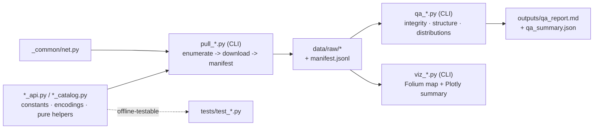
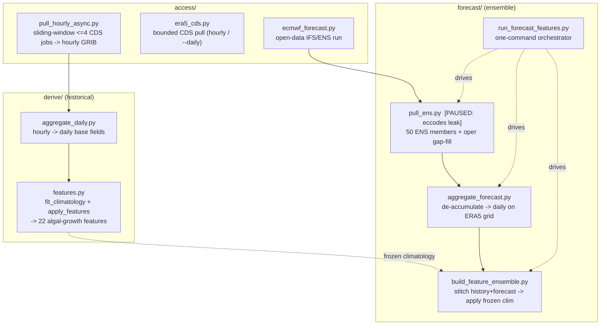
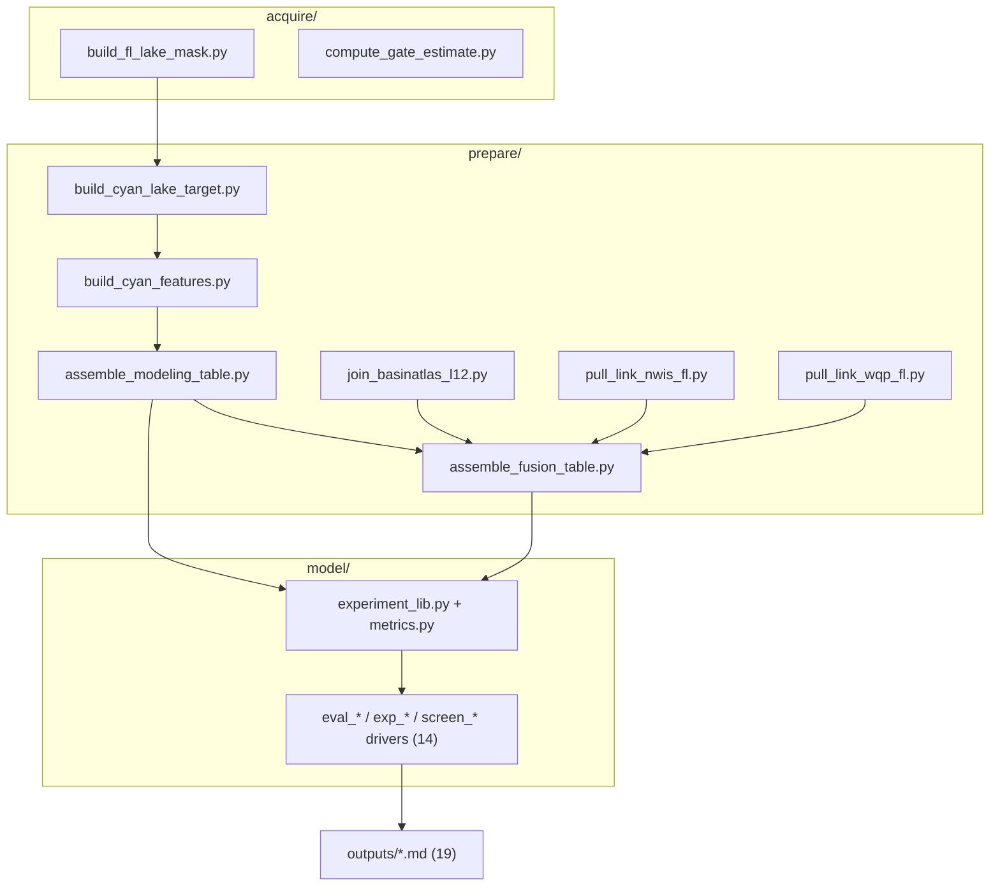
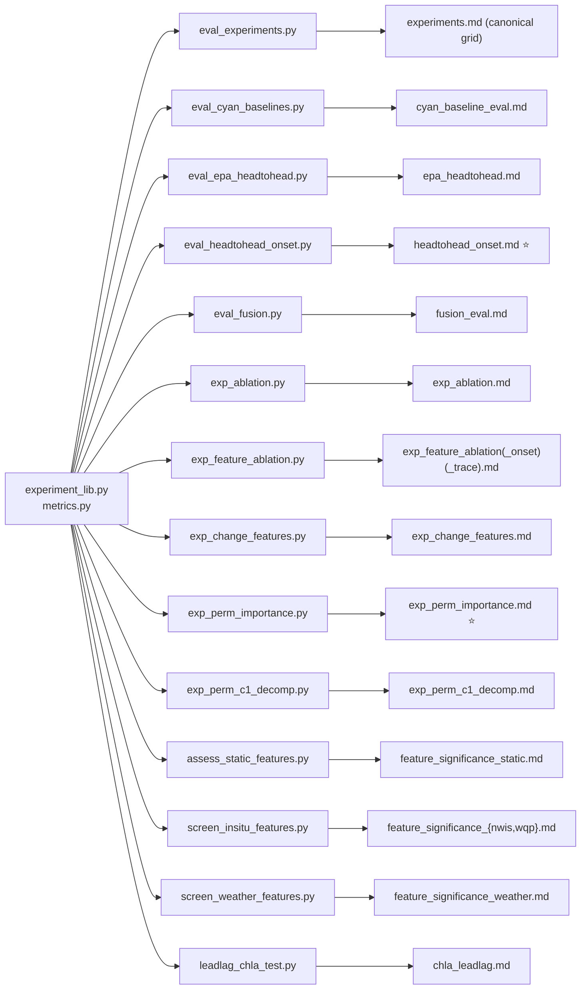
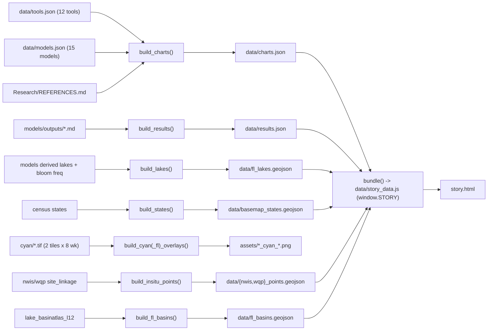
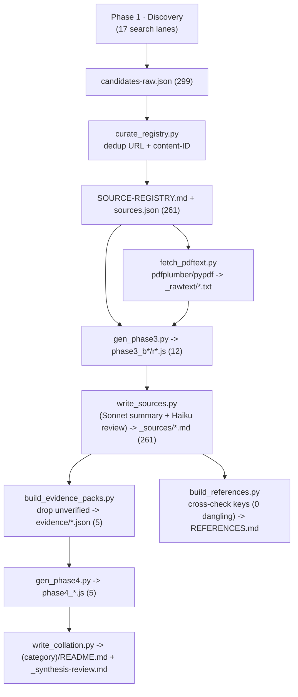

# Code Map — SePRO HAB PoC

> A function-level tour of **all the code in the repository**: entry points, shared libraries,
> per-module call/data-flow graphs, and the pipeline DAGs. For the folder/document structure and the
> big-picture layer diagram, see the companion [`ARCHITECTURE.md`](ARCHITECTURE.md).
>
> Generated 2026-07-10 from a full read of the repo. Function names, inputs, and outputs were read
> from the source; line counts came from `git ls-files | xargs wc -l`.

---

## 1. Code at a glance

| Layer | Language | Files | LOC | Entry points |
|-------|----------|------:|----:|--------------|
| `data-sources/` | Python | ~70 | 9,589 | `access/pull_*.py`, `qaqc/qa_*.py`, `viz/viz_*.py` (CLIs) |
| `models/` | Python | 25 | 3,677 | `prepare/*.py`, `model/eval_*.py`, `model/exp_*.py` (CLIs) |
| `presentation/` | Python + HTML/JS | 3 + 1 | 1,273 + `story.html` (1,558) | `build_story_assets.py`; `story.html` |
| `dashboard/` | Python + HTML/JS | 1 + 1 | 468 + `index.html` (585) | `build_dashboard_data.py`; `index.html` |
| `analysis/` | Python | 1 | 361 | `matchup.py` (CLI) |
| `Research/` | Python + generated JS | 8 + 17 | 1,523 + JS | `scripts/*.py`; `scripts/phase{3,4}_*.js` |

**Biggest first-party files:** `presentation/story.html` (1,558) · `presentation/build_story_assets.py`
(687) · `dashboard/index.html` (585) · `data-sources/NWIS/access/nwis_api.py` (521) ·
`data-sources/EPA-NARS/viz/viz_nars.py` (486) · `dashboard/build_dashboard_data.py` (468) ·
`data-sources/weather/derive/features.py` (427).

**Common conventions across all Python:**
- **CLIs are idempotent** — completed steps are cached/skipped; re-runs are safe.
- **No network on import** — API modules only touch the network inside functions.
- **Manifests everywhere** — every download appends a JSONL record (url, bytes, sha256, timestamp).
- **Fixed seeds** (`SEED = 42`) and deterministic pipelines — results regenerate bit-for-bit.
- **Leakage guards are hard asserts**, not soft checks (temporal cutoffs, train-only fits).

---

## 2. `data-sources/` — acquisition & QA code

### 2.1 Shared scaffolding — `_common/net.py`

The dataset-agnostic HTTP/auth/cache/manifest layer. No side effects on import.

| Function | Purpose |
|----------|---------|
| `load_dotenv()` | Minimal `.env` parser (env wins) |
| `resolve_appkey()`, `resolve_edl_token()` | Credential resolution (e.g. CyAN Earthdata bearer) |
| `make_session()` | `requests.Session` with retry/backoff (5 retries, 1.5× backoff, 429/5xx forcelist) |
| `download_file(session, url, dest, …, expected_sha256)` | Cached download: sha256 validate → skip / refetch / flag; atomic write; returns `DownloadResult` |
| `append_manifest(path, record)`, `read_manifest(path)` | JSONL audit trail (url, bytes, sha256, accessed_utc, integrity) |
| `_sha256(path)`, `_utc_now_iso()` | Utilities |

Every `access/` script builds a session via `make_session()` and records each pull with
`download_file` + `append_manifest`. `_template/` holds the skeleton (`METADATA.template.md` +
`README.md`) that every dataset mirrors.

### 2.2 The per-module code pattern

Each dataset repeats the same internal shape — a low-level API module (constants + encodings + pure
helpers, no network on import) and a high-level CLI (`pull_*.py`) that enumerates, downloads, and
manifests; then `qaqc/` reads `data/raw/` and writes reports; `viz/` renders maps/plots.



### 2.3 Per-module code detail

| Module | API / access code | QA | Viz | Tests |
|--------|-------------------|----|-----|-------|
| **cyan** | `cyan_api.py` (DN↔CI math `dn_to_ci`, `classify_dn`, `search_files`, `parse_cyan_filename`, `read_processing_version`), `pull_cyan.py`, `backfill_manifest_version.py` | `qa_cyan.py` (integrity, CRS/EPSG:5070, DN distribution, cross-file consistency) | `viz_cyan.py` (Albers→lat/lon warp, log colormap, Folium + Plotly) | — |
| **EPA-NARS** | `nars_catalog.py` (pinned per-cycle manifest, `reconcile_manifest` drift check), `pull_nars.py` | `qa_nars.py` (dictionary alignment, site counts, geotagging, toxin detect-vs-ND, survey-weight caveat) | `viz_nars.py` (per-lake microcystin map + summary charts) | `test_nars_catalog.py` (13) |
| **NWIS** | `nwis_api.py` (OGC collections + HAB pcodes, `iter_items` cursor pagination, `enumerate_sites`, `get_time_series_catalog`, `pull_series`, `RateLimitError`), `pull_nwis.py` | `qa_nwis.py` (integrity, counts, date/provisional boundary, value ranges, qualifiers) | — | — |
| **WQP** | `wqp_api.py` (dual-schema `build_url`, `COLUMN_CROSSWALK`, `wqp_date` MM-DD-YYYY quirk, `count_headers` HEAD, censoring, `canonical_dedup_key`), `discover_wqp.py`, `xcheck_dataretrieval.py` | *planned* | *planned* | `test_wqp_api.py` |
| **cyano-forecasts** | `qlik_public.py` (reverse-engineered QIX WebSocket: session → OpenDoc → ClearAll → hypercube → paged read with fail-closed row/col asserts; `matrix_to_rows` pure parser), `pull_forecasts.py` (append-only snapshots + revision tracking), `pull_official.py` (DOI ZIP) | `qa_forecasts.py` (row-count asserts, null composition, ranges, cross-app agreement) | `viz_forecasts.py` (per-lake % map; hotspot sanity) | `test_qlik_public.py` (5, offline) |
| **weather** | see §2.4 | `qa_weather.py` (integrity, grid/encoding, ERA5T expver flag, accumulation handling) | `viz_weather.py` (native 0.25° cell map) | 5 test files, see §2.4 |

### 2.4 The weather module — the most complex pipeline

`weather/` has three code subfolders: `access/` (pull), `derive/` (historical features), and
`forecast/` (ensemble features). The historical and forecast tracks share the feature math but
differ in how the climatology is fit (fit-once-and-freeze, for leakage safety).



Key functions to know:
- **`features.py`** splits into `fit_climatology(daily_ds, gdd_base)` (SPEI per-month Pearson-III
  moments, computed once) and `apply_features(daily_ds, climatology, …)` (no fitting branch — errors
  if climatology missing). This split is what makes forecast SPEI **leakage-safe**: a stitched member
  series can't re-fit the climatology. `build_features()` is the historical convenience wrapper.
- **`aggregate_forecast.py`** de-accumulates ECMWF's cumulative-from-step-0 `tp`/`ssrd` (difference
  consecutive steps, clip packing-noise negatives, sum into UTC days across the 3h→6h transition) —
  the unit-tested core.
- **`build_feature_ensemble.py`** stitches ERA5 history to each of 50 members, applies the frozen
  climatology, and asserts exactly 50 members before writing (fail-closed). Precip gap-fill uses
  climatological median, never linear interpolation.

Tests (`tests/`): `test_deaccum.py` (7), `test_stitch_seam.py` (4), `test_features.py` (7),
`test_features_regression.py` (7, bit-exact pre/post refactor), `test_era5_daily.py` (4); `_synth.py`
generates offline fixtures.

---

## 3. `models/` — the modeling code

### 3.1 The pipeline DAG (acquire → prepare → model → outputs)



### 3.2 `prepare/` — table assembly (inputs → outputs)

| Script | Consumes | Produces |
|--------|----------|----------|
| `build_fl_lake_mask.py` (acquire) | CyAN resolvable-lakes shapefile + FL state polygon | `fl_resolvable_lakes.gpkg` (133 lakes) |
| `build_cyan_lake_target.py` | FL lakes + OLCI weekly rasters | `cyan_lake_weekly_fl.parquet` (mean/median/SD/**bloom = median DN≥130**) |
| `build_cyan_features.py` | `cyan_lake_weekly_fl.parquet` | `cyan_features_fl.parquet` (lags, bloom_roll4, gap weeks — the AR ladder) |
| `assemble_modeling_table.py` | the two above | `modeling_table_cyan_fl.parquet` (horizon-paired, leakage-guarded persistence) |
| `join_basinatlas_l12.py` | FL lakes + BasinATLAS L12 | `lake_basinatlas_l12.parquet` (static attrs) |
| `pull_link_nwis_fl.py` / `pull_link_wqp_fl.py` | NWIS / WQP raw + linkage | `interim/{nwis,wqp}_fl/{daily_values,site_linkage}.parquet` |
| `assemble_fusion_table.py` | CyAN table + L12 + NWIS + WQP + weather NC | **`modeling_table_fusion_fl.parquet`** (44 features; 339,400×58) |

The temporal leakage guard is enforced in `assemble_modeling_table.py`: for every row,
`target_date − feature_date == 7·(h+1)` days (latency-aware persistence
`Persistence(W,h) = bloom(W−h−1)`), asserted rather than assumed.

### 3.3 Shared harness — `experiment_lib.py` + `metrics.py`

Every experiment runs through one training harness so the split, refit protocol, and metric suite
are identical across the grid.

**`metrics.py`** — one source of truth for scoring:
- `classification_metrics(y, p, thr)` → AUC-ROC, AUC-PR, Brier, MCC, F1, Precision, Recall, Accuracy.
- `best_f1_threshold(y, p)` → operating point tuned on **validation**, held fixed for test.

**`experiment_lib.py`** — feature blocks + training routine:

| Symbol | What |
|--------|------|
| `CYAN` (15), `STATIC` (6), `SEASON` (2), `WEATHER` (10), `INSITU` (9) | named feature blocks; `DRIVERS = STATIC+SEASON+WEATHER+INSITU` |
| `TRAIN_END="2022-07-01"`, `VAL_END="2024-07-01"`, `HORIZONS=[0..4]`, `PRIM=1`, `SEED=42` | split + run constants |
| `load()`, `prep(df)`, `split(df)` | load fusion table, add derived cols, temporal 60/20/20 split |
| `add_clim(fit, frame)` | per-(comid, month) bloom-rate lookup — **fit on train-only** (leakage-safe) |
| `Xof(frame, feats, fit_source)` | feature matrix; computes clim/anomalies from `fit_source` only |
| `_lr()`, `_hgb()` | logistic GLM pipeline · HistGradientBoosting config |
| **`fit_predict(arch, feats, tr, va, te)`** | fit train → tune F1 threshold on val → **refit train+val** → predict test |
| `per_lake_auc(y, p, comid)` | median within-lake AUC (strips between-lake artifacts) |
| `transition(y, p, pers, thr)` | flip / **onset** / offset MCC + onset-AUC on the relevant subsets |
| `epa_pred()` | load EPA forecast rows (comid, target_end, percent_chance) |
| **`run_experiment(suites, archs, out_path, …)`** | master entry: train each suite×arch×horizon, add baselines + EPA rows, write a Markdown table |

The three architectures actually built: **logistic GLM**, **HistGradientBoosting** (400 iters, lr
0.06, 31 leaves), **XGBoost** (600 iters, depth 6, early stop). SVC and GAM were in the design but
not built (architecture barely mattered).

### 3.4 `model/` drivers → `outputs/`



Roles: **evals** benchmark the model against baselines/EPA; **experiments** (`exp_*`) probe *why*
the model works — greedy ablation strips 44 features to 2 with no AUC loss; correlation-clustered
permutation importance (`exp_perm_importance.py`) finds the CyAN cluster carries ~100% of skill;
`exp_perm_c1_decomp.py` shows `clim` is a redundant-but-exploited memorization shortcut. **Screens**
(`assess_static_features`, `screen_insitu_features`, `screen_weather_features`, `leadlag_chla_test`)
are the Task-A univariate feature assessment, run on train years only. `experiments.md` is the
canonical result grid; `headtohead_onset.md` and `exp_perm_importance.md` carry the headline story.

---

## 4. `presentation/` — deck code

### 4.1 `build_story_assets.py` (687 LOC) — the asset builder

Deterministic; reads only checked-in real data and regenerates everything downstream.



Named builders each own one asset: `build_charts` (Plotly panels + resolved citations),
`build_results` (Findings metrics parsed from `models/outputs/*.md` — nothing hand-entered),
`build_lakes`/`build_states`/`build_fl_basins`/`build_insitu_points` (geo layers),
`build_cyan_overlays`/`build_cyan_fl_overlays` (8-week CyAN rasters reprojected to EPSG:3857 for
Leaflet), and `bundle()` which writes the single `window.STORY` object so the page loads from
`file://` (browsers block `fetch()` of local files).

### 4.2 `story.html` (1,558 LOC) — runtime

Loads `data/story_data.js`, then: an **IntersectionObserver** toggles `is-active` for scroll fade-in;
~7 named Plotly builders read `window.STORY.charts` / `.results` and call `Plotly.newPlot`; a single
pinned **Leaflet** map morphs through 6 data-steps (base layer toggle political/satellite; CyAN
`L.imageOverlay` driven by an 8-week slider; GeoJSON layers for lakes/NWIS/WQP/basins); `<details>`
dropdowns carry sources/terms/limitations; slides auto-number in DOM order.

### 4.3 Legacy landscape deck

`build_figures.py` (matplotlib → `figures/*.png`) and `build_deck.py` (python-pptx →
`HAB_landscape.pptx`) predate `story.html`. They still consume the same `tools.json`/`models.json`
source-of-truth, so the landscape data has one home feeding both the legacy figures and the live
Plotly charts.

---

## 5. `dashboard/` — Part B tool code

### 5.1 `build_dashboard_data.py` (468 LOC) — deterministic build

Reuses the exact estimator code from `models/model/eval_fusion.py` and `eval_headtohead_onset.py`
(seed 42), so the shipped tool can't drift from the analysis.

```mermaid
flowchart LR
    FUS["models …/modeling_table_fusion_fl.parquet"] --> B["build_dashboard_data.py"]
    CY["…/cyan_lake_weekly_fl.parquet"] --> B
    EPA["cyano-forecasts snapshot .csv"] --> B
    WQP["…/wqp_fl links + daily_values"] --> B
    LK["presentation/fl_lakes + states geojson"] --> B
    B -->|fit per-horizon: fusion(HistGBM) · lean(LogReg cyan_median+area) · climatology| SCORE["score cutoff 2026-05-17, h0-4"]
    SCORE --> GATEA["Gate A: reproduce fusion h1 AUC 0.983 or refuse to write"]
    SCORE --> GATEB["Gate B: shipped model vs persistence on held-out 2026 + onset-AUC"]
    GATEA --> D1["data/dashboard_data.js (window.DASH)"]
    GATEB --> D1
    LK --> D2["data/geo.js (window.FL_LAKES / FL_STATES)"]
```

Key functions: `clim_lut`/`clim_scores` (per-lake-month climatology), `ladder_pipe` (LogReg pipe),
`gbm` (HistGradientBoosting), `Xof` (feature matrix; can inject clim), `bloom_duration_weeks`
(trailing observed-bloom run), `verify_against_eval` (Gate A). Feature blocks (`CYAN`, `STATIC`,
`SEASON`, `WEATHER`, `INSITU`, `TRACK_A`, `LEAN`) mirror `experiment_lib.py` verbatim. The two gates
are the honesty guard: Gate A refuses to write if the published AUC isn't reproduced; Gate B scores
the shipped per-horizon model on genuinely held-out 2026 data **always beside its persistence
baseline** (the honest, fusion-specific signal is onset-AUC on new blooms, where persistence has
zero skill by construction).

### 5.2 `index.html` (585 LOC) — runtime

Loads `dashboard_data.js` + `geo.js`. **Tab 1 (Alerts):** map + ranked list, view toggle
(new-bloom-risk / current-active), horizon selector, per-row "Onset lead" column, row-click → Deep
dive. **Tab 2 (Deep dive):** per-lake Plotly cards (forecast-by-week: fusion/lean/clim/EPA; observed
CyAN + in-situ chl-a history with issue-cutoff marker; disagreement bars; collapsible feature
families with staleness), plus a sortable fleet table beside an explorer map that shades all lakes by
any selected metric. Fidelity caveats from the Codex reviews are rendered in the UI (point-estimate
tooltip, h0-as-nowcast label, EPA-from-later-snapshot note, raw/unharmonized in-situ flag).

---

## 6. `Research/` — the literature-pipeline code

A scripted 6-phase pipeline: deterministic Python for the mechanical steps (dedup, PDF extraction,
schema-validated assembly, references) and **generated** JS workflow scripts for the LLM stages
(each embeds its input data + schema and runs a Sonnet-summarize → Haiku-blind-review pair).



| Script | Reads → Writes |
|--------|----------------|
| `curate_registry.py` | candidates-raw.json → SOURCE-REGISTRY.md (dedup 299→261 via `norm_url` + `content_id`) |
| `fetch_pdftext.py` | sources.json → `_sources/_rawtext/*.txt` (`extract_text` tries pdfplumber then pypdf) |
| `gen_phase3.py` | sources + rawtext → `phase3_b00.js…b05, r00…r05` (embeds source + 28KB pretext + schema) |
| `write_sources.py` | phase-3 output → `_sources/<KEY>-<slug>.md` (per-claim ✓/⚠/✗ verdicts) + processing-log |
| `build_evidence_packs.py` | dossiers → `_discovery/evidence/<cat>.json` (drops verdict-N unverified claims, compacts) |
| `gen_phase4.py` | evidence packs → `phase4_<category>.js` (one per category) |
| `write_collation.py` | phase-4 output → `<category>/README.md` + `_synthesis-review.md` |
| `build_references.py` | all dossier frontmatter → REFERENCES.md (`cross_check` reports 0 dangling) |

The `phase3_*.js` / `phase4_*.js` files are **generated artifacts** (by `gen_phase3.py` /
`gen_phase4.py`), not hand-written — self-contained workflow scripts embedding their input data so
each batch runs independently. The two anti-confabulation design choices: PDF pretext is embedded so
agents can't re-fetch and hallucinate, and the blind reviewer checks claims against the source text
rather than the summarizer's excerpt.

---

## 7. `analysis/` — the matchup study

`analysis/cyan_nla_matchup/matchup.py` (361 LOC, CLI) joins EPA NLA-2022 in-situ measurements to
CyAN satellite mosaics and quantifies agreement + attrition.

| Function | Role |
|----------|------|
| `load_visits()` | NLA site info + chemistry + toxins, merged by UID |
| `load_polygons()` | lake footprints (EPSG:5070 — same grid as CyAN, no reprojection) |
| `index_mosaics()`, `match_mosaic()` | index weekly CyAN files; match a visit date within `--tol-days` |
| `zonal_extract_ci()` | mask CyAN to in-lake pixels; classify water/cloud/land; compute CI stat (max/mean) |
| `ci_floor()` | assign left-censored-low CI to cloud-free water with no valid signal (keep, don't drop) |
| `build_contingency()` | CI-detected × microcystin-detected cross-tab |
| `plot_scatter()` | log-log Spearman scatter (CI vs chl-a; CI vs microcystin) |

CLI: `python matchup.py [--stat max|mean] [--tol-days N]`. Outputs `cyan_nla_matched.csv` (334 usable
matches), `matchup_report.md` (attrition funnel + Spearman ρ + contingency), `matchup_scatter.png`.

---

## 8. Test inventory

| Location | File(s) | Covers |
|----------|---------|--------|
| `data-sources/weather/tests/` | `test_deaccum.py` (7), `test_stitch_seam.py` (4), `test_features.py` (7), `test_features_regression.py` (7), `test_era5_daily.py` (4) | de-accumulation, history stitch, feature math, bit-exact regression, CDS cost chunking |
| `data-sources/cyano-forecasts/tests/` | `test_qlik_public.py` (5) | offline QIX parsing + fail-closed row/col asserts |
| `data-sources/EPA-NARS/tests/` | `test_nars_catalog.py` (13) | catalog parsing, drift/manifest reconciliation |
| `data-sources/WQP/tests/` | `test_wqp_api.py` | URL building, MM-DD-YYYY dates, schema crosswalk |

Tests concentrate on the high-risk pure-function cores (weather de-accumulation/stitching/features,
the reverse-engineered QIX parser, the NARS drift check). Data acquisition CLIs are integration-
tested via live `--dry-run`; the modeling layer is validated through its result files + Codex
adversarial reviews (`models/CODEX_REVIEW_workflow.md`, `dashboard/CODEX_REVIEW_*.md`) rather than
unit tests.

---

## 9. Cross-cutting code invariants

The properties every layer's code upholds, and where they live:

- **Determinism / seeds** — `SEED = 42` in `experiment_lib.py` and `build_dashboard_data.py`; fixed
  climatology fits; deterministic dedup in `curate_registry.py`. Same inputs → same bytes out.
- **Leakage guards as asserts** — temporal cutoff `target_date − feature_date == 7·(h+1)`
  (`assemble_modeling_table.py`); train-only normalization + clim (`experiment_lib.Xof`/`add_clim`);
  frozen weather climatology (`features.apply_features`); train-years-only feature screens.
- **Fail-closed acquisition** — QIX reader asserts exact row/column counts; ensemble build asserts
  exactly 50 members; `download_file` validates sha256 against the manifest and flags mismatches.
- **No silent aggregation / truncation** — every spatial/temporal reduction is explicit and
  documented; excluded rows are counted and logged, never dropped quietly (per `CLAUDE.md`).
- **One source of truth per concept** — metrics via `metrics.classification_metrics`; feature blocks
  defined once in `experiment_lib.py` and mirrored in `build_dashboard_data.py`; landscape data in
  `tools.json`/`models.json`.

---

*For the folder/document structure, layer diagram, and deployment topology, see
[`ARCHITECTURE.md`](ARCHITECTURE.md).*
